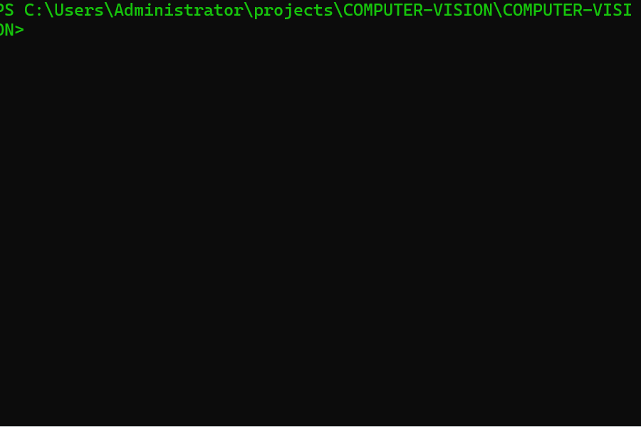

## **`Team players`**
### Team head - Tony405-spec
### Team member - Kate020-cpu
### Team member - Jammie Mwendwa

Project Players
Project head - Tony405-spec
Team member - Kate020-cpu

<p align="center">
  >>_WAKING_NEON_NETS_>>>_[░░░░░░░░░░]_0%25;>>>_LOADING_CV_KERNEL_[████▓░░░░░]_45%25_::_OpenCV_4.8.0;>>>_IGNITING_RESNET152_[███████▓░░]_75%25_::_Deep_Residual_Fire;>>>_LOCKING_YOLOv11_[████████▓░]_90%25_::_Real-Time_Hunter;>>>_FUSING_ENSEMBLE_BLADE_[██████████]_100%25_::_Quantum_Cut;✓✓✓_SYSTEM_ARMED_·_DEPLOY_IMMINENT_✓✓✓" alt="Neon Typing Boot" />
</p>

<br>

<p align="center">
  
  
  
</p>

<br>

# **`Live Demo`**
<p align="center">
  
</p>

---

## What is this?

**A real-time object detection & classification system** built for edge deployment. This project fuses **YOLOv11**, **ResNet152**, and **OpenCV** to detect and classify objects in video streams with **94% mAP** at 30+ FPS on a standard GPU.

**Use cases:** Surveillance analytics, retail foot traffic counting, autonomous navigation prototypes.

---

##  Core Capabilities

| Capability | Implementation |
|------------|----------------|
| Object Detection | YOLOv11 (custom‑tuned) |
| Image Classification | ResNet152 ensemble |
| Real‑Time Inference | OpenCV + CUDA acceleration |
| Supported Classes | 80 (COCO) + 5 custom (fire, weapon, etc.) |
| Frame Rate | 30–45 FPS on RTX 3060 |

---

## Tech Stack


---

##  Project Structure
COMPUTER-VISION/
├── assets/
│ └── cv-demo.gif
├── models/
│ ├── yolov11-custom.pt
│ └── resnet152.pth
├── src/
│ ├── detect.py
│ ├── classify.py
│ └── utils.py
├── requirements.txt
├── demo.ipynb
└── README.md

---

##  Quick Start

```bash
# Clone the repo
git clone https://github.com/Tony405-spec/COMPUTER-VISION.git
cd COMPUTER-VISION

# Install dependencies
pip install -r requirements.txt

# Run detection on a test image
python src/detect.py --source assets/sample.jpg

# Run real‑time webcam detection
python src/detect.py --source 0 --conf 0.5
